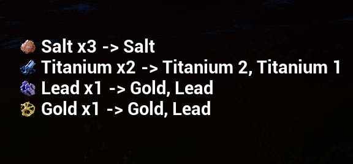
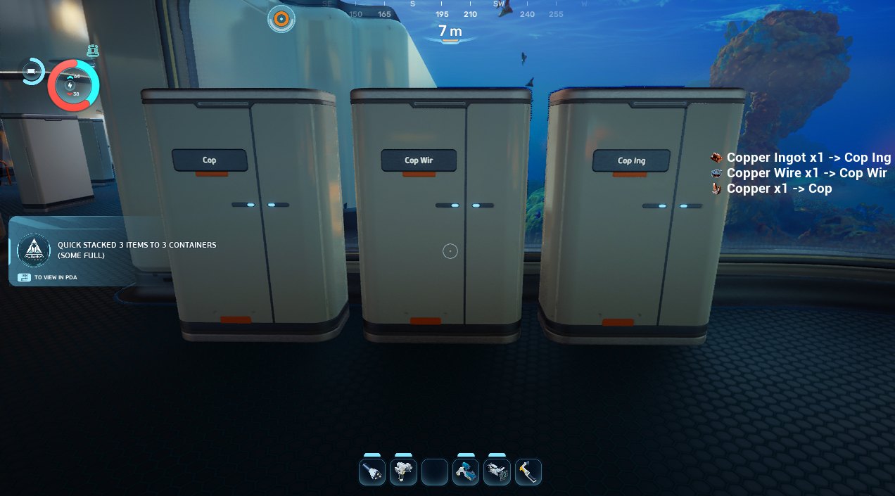

# QuickStack

A Subnautica 2 mod for fast inventory management. **Fully supported in multiplayer.**

- **Press N** — quick-stack items into all nearby containers that already hold matching items, and auto-swap batteries from chargers
- **Press G** (while viewing a container) — quick-stack matching items into that specific container

## Features

### Transfer Summary UI
After quick-stacking, a panel slides in from the right showing item icons, counts, and destination containers for everything that was transferred. Fully configurable.

### Smart Label Routing
Label your lockers and items route to the best match. Uses token-prefix scoring — the most specific locker always wins.

- `Copper Wire` or `Cop wir` matches Copper Wire but not Copper
- `Copper, Salt` matches both item types (comma = OR)
- `Titanium 1`, `Titanium 2` — numbers are ignored (locker identifiers)
- Prefix `%x` on a label to exclude that locker entirely

### Full Language Support
Labels match against the item's localized display name — label your lockers in whatever language you play in.

### Battery & Power Cell Swap
Automatically swaps drained batteries and power cells with higher-charged ones from nearby chargers.

### Item Protection
Tools, equipment, and consumables are protected from stacking by default. Add specific items to `keep_types` in config to protect them too.

## Requirements

- Subnautica 2 (Steam/Game Pass)
- [UE4SS for Subnautica 2](https://github.com/Subnautica2Modding/Subnautica2-UE4SS)

## Installation

1. Install UE4SS for Subnautica 2
2. Download the latest release from [Releases](../../releases)
3. Extract the `QuickStack` folder into `Subnautica2/Subnautica2/Binaries/Win64/ue4ss/Mods/`
4. Launch the game

## Configuration

Edit `Mods/QuickStack/config.txt`:

### Controls
| Setting | Default | Description |
|---------|---------|-------------|
| `keybind` | N | Key to trigger quick-stack (nearby containers) |
| `keybind_open` | G | Key to quick-stack into the currently open container |
| `cooldown` | 1.0 | Seconds between activations |

### Stacking Behaviour
| Setting | Default | Description |
|---------|---------|-------------|
| `radius` | 25 | Meters to scan for containers |
| `stack_tools` | false | Allow tools to be quick-stacked |
| `stack_equipment` | false | Allow equipment to be quick-stacked |
| `stack_consumables` | false | Allow food/water/medical to be quick-stacked |
| `keep_types` | *(empty)* | Comma-separated item FNames to never stack |

### Label Routing
| Setting | Default | Description |
|---------|---------|-------------|
| `label_routing` | true | Route items to lockers based on their label |
| `exclude_prefix` | %x | Lockers with this prefix are completely skipped |
| `label_prefix` | *(empty)* | Only match lockers whose label starts with this prefix |
| `label_max_chars` | 50 | Max characters allowed in locker label input (game default is 15) |

### Battery Swap
| Setting | Default | Description |
|---------|---------|-------------|
| `battery_swap` | true | Auto-swap batteries/power cells from nearby chargers |

### Notifications & Summary Panel
| Setting | Default | Description |
|---------|---------|-------------|
| `notify` | true | Show text toast notification |
| `summary_panel` | true | Show the transfer summary panel with item icons |
| `summary_show_destination` | true | Show destination container labels in the panel |
| `summary_duration` | 6 | Seconds the summary panel stays on screen |

## Links

- [Nexus Mods](https://www.nexusmods.com/subnautica2/mods/80)
- [GitHub Releases](../../releases)

## License

MIT
